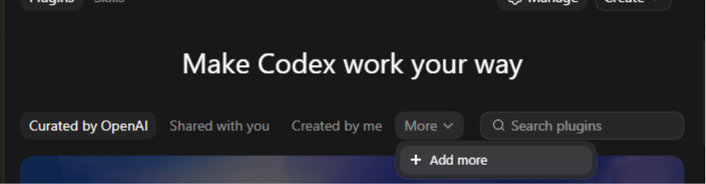
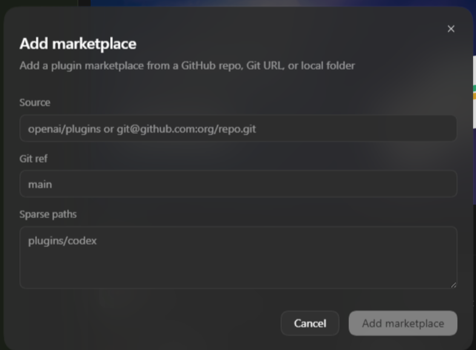
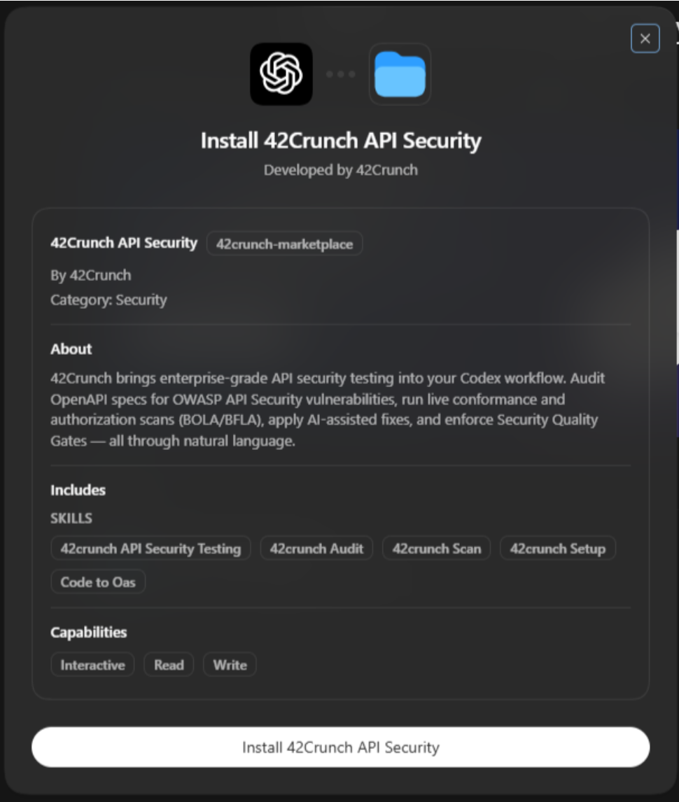
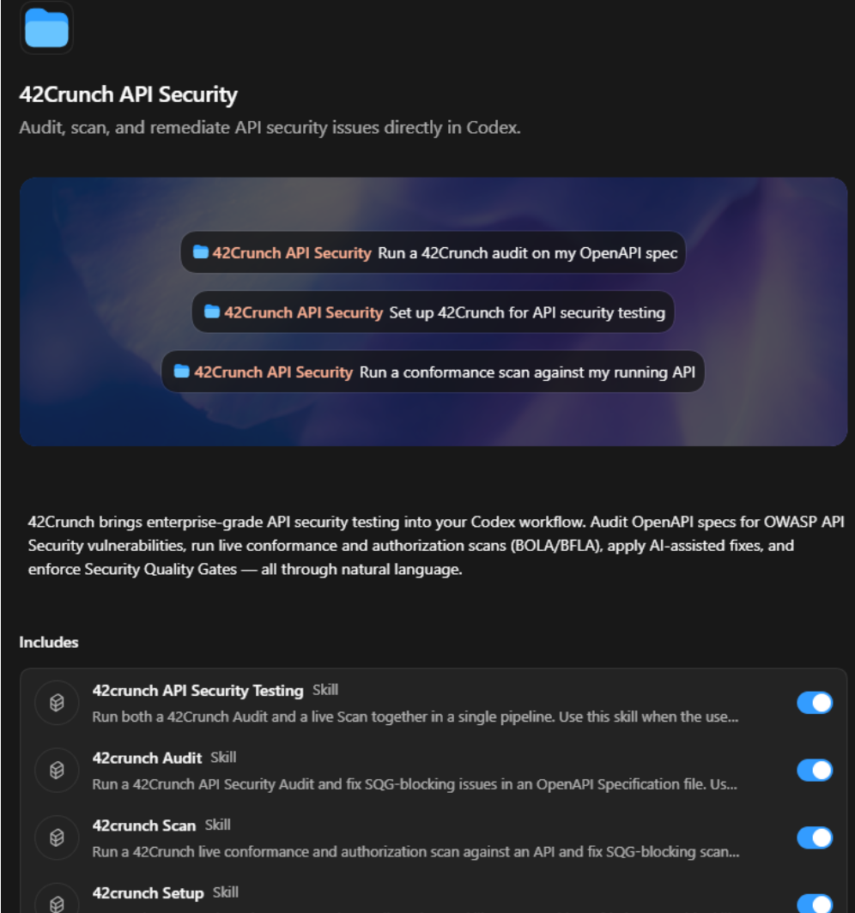

# 42Crunch Codex Plugins

The official [42Crunch](https://www.42crunch.com) plugin marketplace for Codex — a catalog of AI-powered plugins that bring 42Crunch's API security capabilities directly into your Codex workflow.

42Crunch plugins give Codex the ability to audit OpenAPI specs, scan live APIs for vulnerabilities, and apply fixes to ensure APIs meet security guardrails.

## Structure

```
.agents/
  plugins/
    marketplace.json            # Plugin registry manifest
plugins/                        # Codex plugins developed by 42Crunch
  api-security-testing/
    skills/                     # Skill definitions
    references/                 # Reference definitions
    README.md                   # Documentation
    LICENSE                     # License
```

## Adding this Marketplace

### Via CLI

Register the 42Crunch marketplace with Codex:

```
codex plugin marketplace add 42Crunch-AI/codex-plugins
```

For a local checkout, add the repo root directory:

```
codex plugin marketplace add /absolute/path/to/codex-plugins
```

After the marketplace is added:

- If your Codex build supports plugin installation from the CLI, install with:

```
codex plugin install api-security-testing@42crunch-marketplace
```

- If your Codex build only exposes `codex plugin marketplace ...` commands, open the Codex app/UI and install `api-security-testing` from the `42Crunch` marketplace there.

### Via the Codex Application (UI)

1. Open the Codex application and click **Plugins** in the sidebar.
2. Click the **More** dropdown, then select **+ Add more**.

   

3. Fill in the **Add marketplace** form:
   - **Source:** `https://github.com/42crunch-AI/codex-plugins.git`
   - **Git ref:** `main`
   - **Sparse paths:** *(leave blank)*

   

4. Click **Add marketplace**.

## Plugin Installation (UI)

1. Go back to the **Plugins** main page and open the **More** dropdown.
2. Click **+** to select **42Crunch API Security**.

   

3. Click **Install**.

## Using the 42Crunch API Security Testing Plugin

1. Go to the **Plugins** page and open the **More** dropdown.
2. Select the **42Crunch** marketplace, then click **42Crunch API Security**.

   

## Available Plugins

### [api-security-testing](./plugins/api-security-testing/)

AI-powered API security plugin backed by 42Crunch. Audit OpenAPI specs, detect OWASP API Security vulnerabilities (including BOLA/BFLA), run live conformance and authorization scans against running APIs, and apply AI-assisted fixes — all through natural language.

**Install:** add the marketplace, then install `api-security-testing` from the CLI if supported, or from the Codex UI if your build does not expose `codex plugin install`.

See the [plugin README](./plugins/api-security-testing/README.md) for full documentation.


## Links

- [42Crunch](https://42crunch.com/)
- [42Crunch Documentation](https://docs.42crunch.com)
- [42Crunch on GitHub](https://github.com/42Crunch)
- Support: support@42crunch.com
